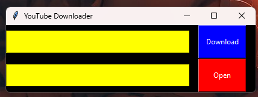

# ${TKinter\  {\color{red}CustomTheme}}$

$${\color{orange}Asmr  \color{lightblue}C \color{orange}ode \color{lightblue}Z}$$

I create practical software with GUI using python, i hope all of them help u to solve ur problems.

## $\textcolor{orange}{ScreanShot}$

P1 = YoutubeDownloader

  <kbd>
    
    
  </kbd>

